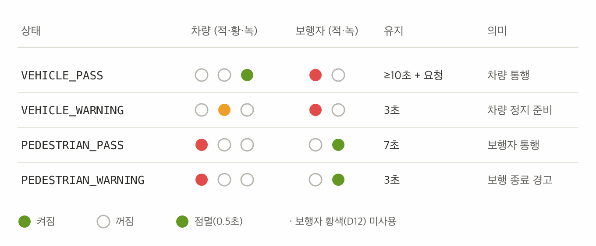
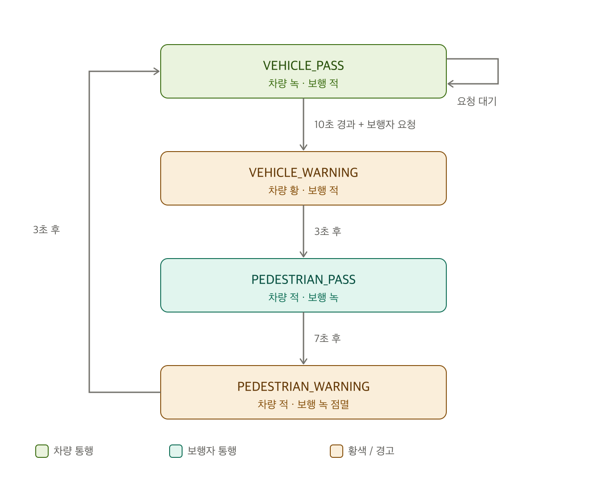

# 🚦 스마트 신호등 프로젝트


> *"스마트 신호등 시스템은 실시간으로 교차로의 상황을 감지하고 신호를 자동으로 조정하여 교통 흐름을 개선할 수 있습니다."*

## 프로젝트 개요
### 동기

우리가 매일 마주하는 신호등은 대부분 **고정된 시간 주기**로만 동작한다. 길에 차도 사람도 없는 새벽에도 신호는 정해진 시간만큼 어김없이 바뀌고, 정작 보행자가 기다릴 때는 한참을 멈춰 서 있어야 한다. 즉 **실시간 교통 상황을 반영하지 못해 불필요한 대기와 비효율**이 생긴다.

그렇다면 "상황에 반응하는 똑똑한 신호등"을 직접 만들어 보면 어떨까? 이 프로젝트는 그 질문에서 출발했다. 그리고 만드는 과정에서 한 가지를 더 배웠다 — 신호등은 **편리함보다 안전이 우선인 시스템**이라는 점이다. 아무리 똑똑해도 노란불을 건너뛰거나 멈춰 버리는 신호등은 만들어선 안 된다.

> *"프로젝트에서 가장 위험한 것은 잘못 짠 코드가 아니라, 무엇을 만들어야 하는지가 정의되지 않은 것이다."*

### 해결방안

**보행자 호출(버튼) 기반의 스마트 신호등**을 아두이노로 구현했다. 평소에는 차량이 통행하고, 보행자가 버튼을 누르면 안전 절차를 거쳐 횡단 신호로 전환된다.

핵심은 단순한 동작이 아니라 **"안전 우선" 설계 원칙**에 있다. 설계를 세 차례(v1 → v2 → v3) 개선하며 다음 세 가지를 확립했다.

| 원칙 | 의미 |
|------|------|
| ① 모든 상태에는 출구가 있다 | 어떤 신호 상태에서도 시스템이 멈추지 않고 다음 상태로 빠져나간다 |
| ② 노란불(과도기)은 절대 생략하지 않는다 | 녹→적 전환 시 반드시 황색을 거쳐 정지를 준비시킨다 |
| ③ 안전 절차는 센서 입력에 의존하지 않는다 | 모든 전이에 타이머를 두어, 센서가 오작동해도 신호는 정상 진행된다 |

또한 초기 코드의 `delay()` 블로킹 방식을 **`millis()` 기반 비차단(non-blocking) 상태 머신**으로 바꿔, 신호가 진행되는 도중에도 매 순간 보행자 버튼을 감지한다. 버튼 입력은 **호출 래치(latch)** 로 기억해 짧게 눌러도 요청이 유실되지 않는다.

> 현재 버전은 기능적으로 "보행자 호출식 신호등"과 동등하며, 초음파·조도 등 센서를 활용한 *진짜 스마트* 기능과 웹 대시보드·AI 챗봇 연동은 향후 과제로 둔다.

### 상태도 및 상태 흐름도

4개 상태(`VEHICLE_PASS` → `VEHICLE_WARNING` → `PEDESTRIAN_PASS` → `PEDESTRIAN_WARNING`)가 타이머와 보행자 요청에 따라 순환한다. 각 상태의 LED 출력과 유지 시간은 아래 상태표와 같다.



상태 사이의 전이 조건은 다음 상태 전이도와 같다. 차량 신호는 **녹 → 황 → 적** 순서를 지키며, 적→녹 복귀는 (한국 신호 체계에 맞춰) 황색 없이 직접 전환한다.




### 부품 배선도

신호등 LED 2조(차량 적·황·녹 / 보행자 적·녹)와 보행자 호출 버튼으로 구성된다.

| 부품 | 아두이노 핀 | 비고 |
|------|:----------:|------|
| 차량 신호등 — 빨강 `CAR_R` | D2 | |
| 차량 신호등 — 황색 `CAR_Y` | D3 | 실제 황색 LED |
| 차량 신호등 — 초록 `CAR_G` | D4 | |
| 보행자 신호등 — 빨강 `PED_R` | D13 | 보드 내장 LED와 공유(의도된 선택) |
| 보행자 신호등 — 황색 `PED_Y` | D12 | 선언만, 미사용(보행자 황색 구간 없음) |
| 보행자 신호등 — 초록 `PED_G` | D11 | |
| 보행자 호출 버튼 `BUTTON` | D9 | `INPUT_PULLUP` — 눌리면 `LOW` |

> 모듈 핀 순서(GND·R·Y·G)에 맞춰 배선했다. 핀 배정 근거는 [v3 상태표 문서](docs/v3-차량황색불-상태표.md) 4장 참고.


## 🛠️ 환경 설정 및 프로그램 설치 (Setup)
본 프로젝트는 하드웨어(Arduino)와 소프트웨어(Python, AI)가 만나는 과정입니다. 원활한 실습을 위해 아래 순서대로 설정을 완료해 주세요.


## 파이썬 라이브러리 설치 (Libraries)
VS Code의 터미널(Terminal)창을 열고 아래 명령어를 복사해서 붙여넣으세요. 이 과정에서 필요한 모든 라이브러리가 자동으로 설치됩니다.

```Bash
pip install -r requirements.txt
```
💡 팁: 명령어를 입력한 뒤 **엔터(Enter)**를 누르고, 설치가 완료될 때까지 잠시 기다려 주세요.

⚠️ 주의: 반드시 VS Code에서 프로젝트 폴더가 열려 있는 상태여야 합니다. (왼쪽 파일 목록에 requirements.txt가 보여야 해요!)

📦 포함된 라이브러리 목록
requirements.txt 파일에는 우리가 사용할 아래의 도구들이 들어있습니다.

```
streamlit==1.55.0
pyserial==3.5
google-genai==1.68.0
pandas==2.3.3
python-dotenv==1.2.2
watchdog==6.0.0
```
- `streamlit`: 복잡한 웹 기술 없이도 파이썬만으로 실시간 데이터 대시보드를 만듭니다.

- `pandas`: 아두이노에서 들어온 수많은 데이터를 표(Table) 형식으로 일목요연하게 정리합니다.

- `pyserial`: 아두이노와 파이썬 사이의 대화 통로를 엽니다.

- `google-genai`: 최신 Gemini AI와 연결하여 챗봇 기능을 구현하고 하드웨어를 지능적으로 제어합니다.

- `python-dotenv`: API 키와 같은 민감한 비밀 정보를 코드와 분리하여 안전하게 관리합니다.

- `watchdog`: 코드나 파일의 변화를 감시하여 대시보드에 즉각 반영되도록 돕습니다.

## ⚡ 프로젝트 실행 방법 (How to Run)

### 🔌 1. 아두이노 연결 및 업로드

- 아두이노 보드를 컴퓨터 USB 포트에 연결하세요.

- 아두이노 IDE에서 작성한 .ino 파일을 보드에 업로드(Upload) 합니다.

### 🖥️ 2. VS Code 터미널 열기

- 단축키 Ctrl + `를 누르거나, 상단 메뉴에서 [터미널] -> [새 터미널]을 클릭하세요.

- 터미널 창에 아래 명령어를 복사해서 붙여넣고 엔터를 누르세요.

```Bash
streamlit run app.py
```

## 아두이노

### 사용 라이브러리

- 현재 신호등 스케치는 **외부 라이브러리 없이** 표준 함수(`Serial`, `digitalWrite`, `millis`)만 사용합니다.
- 향후 파이썬과 시리얼 JSON 통신을 추가할 때 [ArduinoJson 7](https://arduinojson.org/)을 사용합니다.

### 사용 부품

#### 현재 사용

| 부품 | 핀 | 역할 |
|------|----|------|
| 차량 신호등 LED (적·황·녹) | D2 / D3 / D4 | 차량의 통행(녹)·주의(황)·정지(적)를 표시 |
| 보행자 신호등 LED (적·녹) | D13 / D11 | 보행자의 정지(적)·통행(녹)을 표시, 보행 종료 시 녹색 점멸 (황색 D12은 미사용) |
| 보행자 호출 버튼 | D9 | 누르면 요청을 기억(래치)해 차량 최소 통행 시간 경과 후 보행자 신호로 전환 |

#### 🔜 확장 예정 센서

| 센서 | 핀(제안) | 역할 |
|------|----------|------|
| 초음파 센서 (HC-SR04) | Trig D5 / Echo D6 | 정지선의 차량 대기 거리 측정 → 차량 통행 시간 가변화 |
| 조도 센서 (CDS) | A0 | 야간 밝기 감지 → 신호등 LED 밝기 자동 조절(에너지 절약) |
| 적외선 근접 센서 | D7 | 횡단보도 보행자 접근 감지(버튼 보조) |
| 온습도 센서 (DHT11) | D8 | 폭염·강우 시 보행자 통행 시간 연장 |

